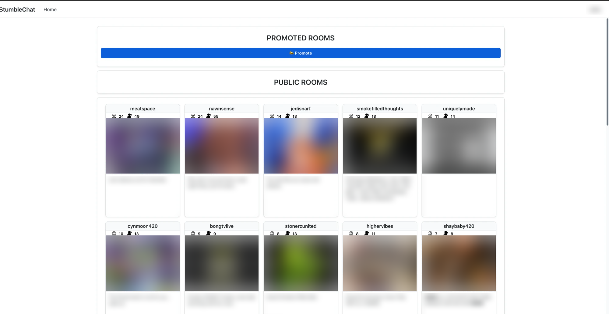
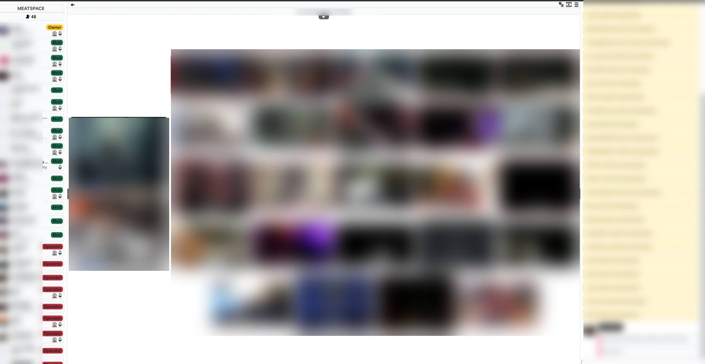
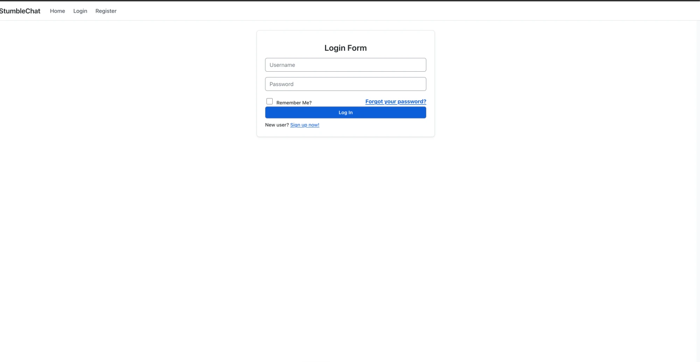

# StumbleChat Accessible

A Chrome extension that gives [stumblechat.com](https://stumblechat.com) a clean, Bootstrap-style light theme and fixes its biggest accessibility problems so it meets WCAG 2.1 AA.

StumbleChat ships as white text on black with translucent panels, neon form glows, hidden scrollbars, `outline: none` on every control, a viewport that blocks pinch-zoom, and user-picked chat colours that are often unreadable. This extension rewrites all of that on the fly: white pages, dark text, proper buttons and forms, a visible focus ring, keyboard access to every control, screen-reader landmarks, and a contrast fixer that keeps everyone's custom chat colours but nudges them until they pass 4.5:1.

No tracking, no network requests, no build step. The only permission is `storage`, for your settings.

## Screenshots

Faces, room previews, and usernames are blurred.

**Directory**



**Chat room** (user list with role badges, broadcast grid with red speaking rings, chat log with colour-corrected messages)



**Login**



## Install

The extension is not on the Chrome Web Store, so it loads as an unpacked extension. This works in Chrome, Edge, Brave, Arc, and Opera.

1. Download this repository: click the green **Code** button, then **Download ZIP**, and unzip it. Or clone it:
   ```bash
   git clone https://github.com/YOUR-USERNAME/stumblechat-accessible.git
   ```
2. Open a new tab and go to `chrome://extensions` (on Edge use `edge://extensions`, on Brave `brave://extensions`).
3. Turn on **Developer mode** with the toggle in the top-right corner.
4. Click **Load unpacked** and select the unzipped `stumblechat-accessible` folder (the one containing `manifest.json`).
5. Open stumblechat.com. It is already restyled.
6. Optional: click the puzzle-piece icon in the toolbar and pin **StumbleChat Accessible** so its settings popup is one click away.

**Updating:** pull or re-download the folder, go back to `chrome://extensions`, click the circular reload arrow on the extension's card, and refresh any open StumbleChat tabs.

**Turning it off:** click the toolbar icon and switch off **Enable light theme**, or disable the extension on `chrome://extensions`.

## Settings

Click the toolbar icon to open the popup. Changes apply instantly to any open StumbleChat tab.

| Setting | What it does |
| --- | --- |
| Enable light theme | Turns the whole restyle on or off. |
| Text size | Scales chat, cards, forms, and nav text from 100% to 150%. |
| High contrast | Switches to a 7:1 palette and re-fits user-chosen chat colours to 7:1. |
| Reduce motion | Stops floating hearts, fades, and pulsing badges. Also follows your OS setting automatically. |

## What it changes

### Look
- White page background, `#212529` text, system font stack, 0.375rem radii, subtle borders and shadows.
- Navbar, room cards, pagination, forms, alerts, modals, dropdowns, context menus, toggle switches, and buttons all follow Bootstrap 5 conventions.
- Start Broadcast, Talk, and open-mic are green; Stop and destructive actions are red; everything else is blue or grey.
- Broadcast tiles take the video's own aspect ratio instead of being letterboxed into a 4:3 box, so the name pill sits on the picture. Embedded players keep their box.
- The speaking indicator is a red ring at every volume level, thicker as the volume rises.
- Every dialog is restyled: media options, theme settings, client settings, room settings, YouTube queue, ban list, profile card, password prompts, media searches.
- The logged-in settings page (all five tabs), the account dropdown, the chat-colour preview, and colour pickers are covered.
- The site's black text-shadow outlines, translucent black panels, neon valid/invalid glows, hidden scrollbars, and 1-second background fades are removed.

### Accessibility (WCAG 2.1 AA)

| Criterion | Fix |
| --- | --- |
| 1.4.3 Contrast (Minimum) | Every theme colour pair is at least 4.5:1 for text and 3:1 for UI, verified by `tools/contrast-check.js`. |
| 1.4.3 for user colours | Users pick their own message colour and nickname background. The content script measures each against its real background and shifts lightness just enough to reach 4.5:1 (7:1 in high contrast) while keeping the hue. Nicknames on custom backgrounds get black or white, whichever reads better. |
| 1.4.1 Use of Colour | Role badges keep their colour and their text label; the colour-only valid/invalid input glow is removed. |
| 1.4.4 Resize Text / 1.4.10 Reflow | The site's `user-scalable=0` viewport is rewritten so pinch-zoom works, and the popup adds a text-size control. |
| 1.4.11 Non-text Contrast | Focus rings, input borders, toggles, and scrollbars are at least 3:1. White SVG icons are inverted so they show on white. |
| 2.1.1 Keyboard | Clickable divs, spans, and links without `href` (pagination, carousel arrows, user rows, broadcast tiles, context-menu and dropdown items) get `tabindex`, a role, and Enter/Space activation. Hover-only dropdowns open on keyboard focus. Escape closes menus. |
| 2.4.1 Bypass Blocks | A "Skip to main content" link is injected. |
| 2.4.3 Focus Order | When a dialog opens, focus moves into it. |
| 2.4.7 Focus Visible | A 3px ring replaces the site's `outline: none`. |
| 1.3.1 / 4.1.2 Name, Role, Value | Landmarks (`navigation`, `main`, `contentinfo`, `region`, `log`, `toolbar`), `dialog` + `aria-modal` on the modal, `menu`/`menuitem` on context menus, `aria-expanded` on dropdown triggers, `aria-current` on the active page, labels for placeholder-only inputs, orphan `<label>`s associated with their inputs, descriptive `alt` on previews, and spoken names for the broadcast/user count badges. |
| 4.1.3 Status Messages | The login error banner is `role="alert"`, the unread-messages pill is `role="status"`, and the chat log is a polite live region. |
| 2.3.3 Animation from Interactions | Honours `prefers-reduced-motion` and the popup toggle. |

## How it works

- `styles/theme.css` is injected at `document_start`, before the page paints, so there is no flash of the dark site. Every rule is scoped to `html.sca11y` (so the popup can switch it off) and uses `!important`, because the site's own stylesheets and the inline styles it writes for user themes would otherwise win.
- `scripts/content.js` applies your settings, rewrites the viewport meta, adds the ARIA and keyboard fixes, and runs the contrast fixer. A `MutationObserver` re-applies everything as the chat and user list change.
- `popup/` is the settings UI, stored with `chrome.storage.sync`.

## Local preview without installing

`test/site/pages/` holds copies of the site's real markup and stylesheets (directory, login, register, the logged-in settings page with all five tabs, and a chat room seeded with sample users and messages). Serve the repo root and open a page; `test/harness.js` loads `theme.css` and `content.js` exactly as Chrome would:

```bash
python3 -m http.server 8765
```

Then open `http://localhost:8765/test/site/pages/room.html`.

Query flags: `?off` (site as shipped), `?hc` (high contrast), `?scale=130` (text size). Room page: `?modal=media|theme|client|youtube|profile|twitch|password|nick|roomsettings`, `?menu` (user context menu), `?live` (broadcasting taskbar and PM list). Settings page: `?tab=user|chat|avatar|room|privacy`, `?menu` (account dropdown).

To check the palette after editing colours:

```bash
node tools/contrast-check.js
```

It fails if any text or UI pair drops below WCAG AA.

## Files

```
manifest.json            MV3 manifest (content script + popup + storage)
styles/theme.css         The theme
scripts/content.js       Settings, contrast fixer, keyboard/ARIA fixes
popup/                   Settings popup
tools/contrast-check.js  Palette verifier
icons/make-icons.py      Regenerates the PNG icons (needs Pillow)
test/                    Fixture pages and harness for previewing without installing
docs/screenshots/        Blurred screenshots used above
```

## Known limits

- The room's header and topic bar keep the site's fixed 19px height because the site's JavaScript positions the video area beneath them, so the topic text stays at 12px there.
- Custom room backgrounds and chat-panel colours from the site's Theme Settings are flattened to white. The user's message colour survives as a left accent bar on each message and as the contrast-corrected text colour.
- The extension can add attributes to the site's HTML but cannot change its nesting (for example, `<a>` elements placed directly inside `<ul>`).
- Built against the site as of September 2026 (`home.css?v=3.1`, `style.css?v=3.0`, `room.js?v=3.1.6`). If the site ships a redesign, selectors may need updating.

## Contributing

Open an issue with a screenshot of anything that still looks wrong or is hard to use. Pull requests are welcome; run `node tools/contrast-check.js` before submitting palette changes.
